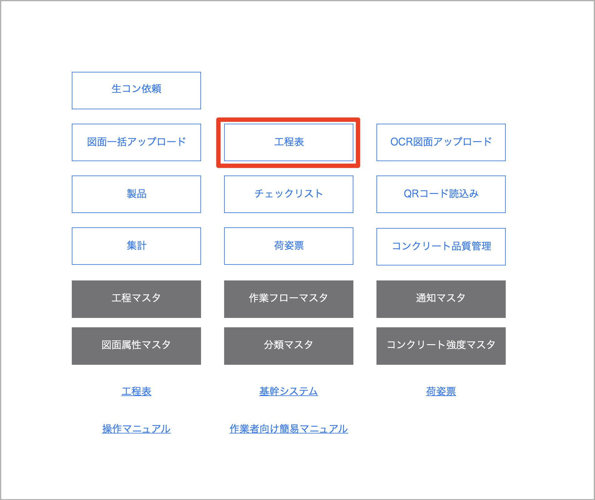
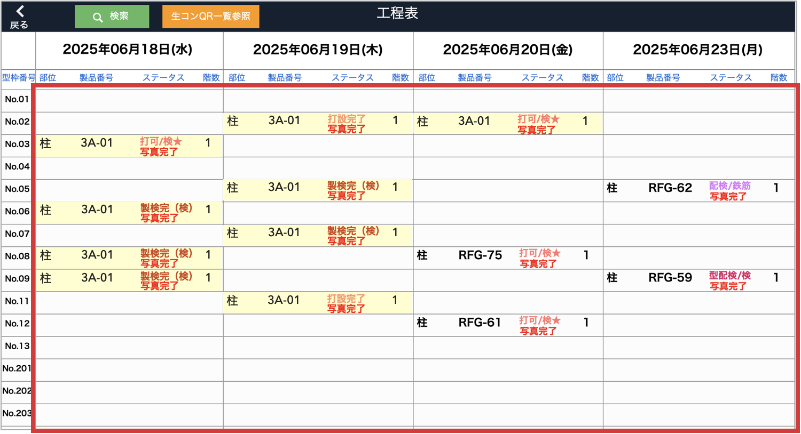
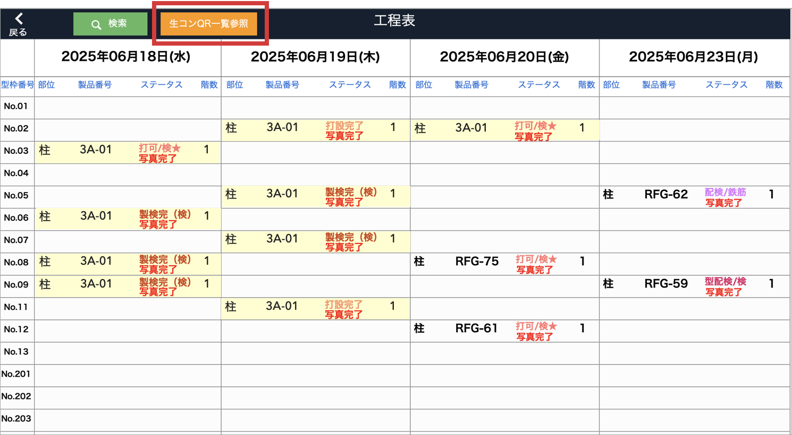
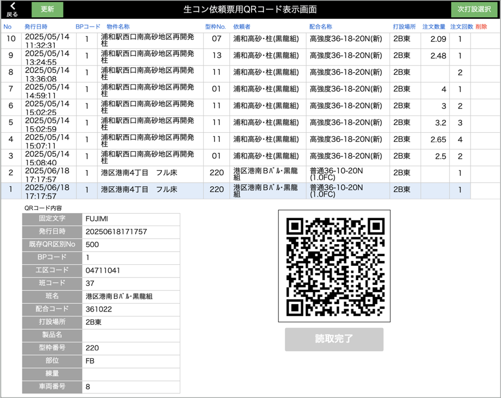

# 生コン注文モニター工程表表示

### 生コン注文済製品の確認

1. [品質管理システム]トップ画面から「工程表」をクリックしてモニター工程表画面に移動します。
        
    <table><tr><td>
    
    </td></tr></table>

1. iPhoneで生コン注文済の製品の背景は黄色で表示されます。  
        
    <table><tr><td>
    
    </td></tr></table>

    {: .note }
    追加注文した製品も同様に背景黄色で表示されます。

### 生コン依頼QRコード表示画面を参照

1. モニター工程表画面左上の「生コンQR一覧参照」をクリックします。
        
    <table><tr><td>
    
    </td></tr></table>

1. 生コン依頼QRコード参照画面が表示されます。
        
    <table><tr><td>
    
    </td></tr></table>

    {: .warning }
    モニター工程表から生コン依頼QRコート表示画面に遷移した場合は、「読取完了」と「削除」は行えません。
