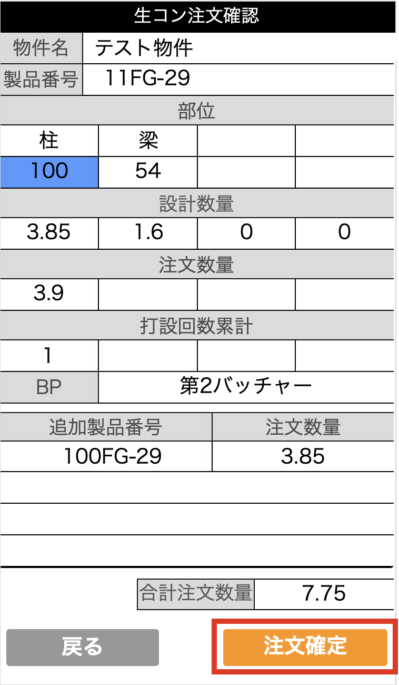

# 生コンの注文を行う

{: .warning }
こちらの機能はiPhoneでの操作を想定しております。

### 生コンの新規注文

以下の条件を満たす製品のみ生コン注文に進むことが可能です。
- 製造ラインステータス：「打可/★」以上
- 写真撮影ステータス：「写真完了」

 

1. [品質管理システム]トップ画面から「生コン依頼」>「生コン注文」を選択します。
    
    <table><tr><td>
    
    </td></tr></table>

1. カメラが起動するので、カメラで生コン注文を行う製品のQRコードを読み込み、生コン注文画面に移動します。

    <table><tr><td>
    
    </td></tr></table>

1. 生コン注文を行う配合を選択します。
    
    <table><tr><td>
    
    </td></tr></table>

1. 数量の欄を選択すると、数量入力用キーパットが表示されるので、任意の数量を入力します。
    
    <table><tr><td>
    
    </td></tr></table>

1. バッチャープラントを変更する場合はプルダウンで変更します。
    
    <table><tr><td>
    
    </td></tr></table>

1. 入力が完了したら「注文」ボタンクリックで注文確認画面に移動します。
    
    <table><tr><td>
    
    </td></tr></table>

    {: .warning }
    追加注文を行う場合は注文確認画面に移動する前に[追加注文](#生コンの追加注文)をする必要があります。

1. 入力内容を確認し、「注文確定」ボタンクリックで生コン注文が完了します。
    
    <table><tr><td>
    
    </td></tr></table>

 

### 生コンの追加注文

1. [生コンの新規注文](#生コンの新規注文)の手順1~5まで進めます。

1. 「追加」ボタンクリックでカメラが起動するので、追加注文を行う製品のQRコードを読み込み、追加注文画面に移動します。

    ○追加可能な製品の条件は以下の通りです。

    | 追加可能な製品の条件                              | 
    | --------------------------------------------- | 
    | 同じ物件の製品                                   | 
    | 追加製品の配合1~4のどれかに注文する配合が存在する     | 
    | 製造ラインステータス：「打可/★」以上                | 
    | 写真撮影ステータス：「写真完了」                    | 

    <table><tr><td>
    
    </td></tr></table>

1. 注文数量を入力して「追加」ボタンをクリックします。
    
    <table><tr><td>
    
    </td></tr></table>

1. 追加した製品番号と数量が一覧で表示されます。
    
    <table><tr><td>
    
    </td></tr></table>

    ○補足  
    追加製品の数量変更と削除方法は以下の通りです。

    <table><tr><td>
    
    </td></tr></table>

1. 製品の追加が完了したら、「注文」ボタンクリックで注文確認画面に移動します。
    
    <table><tr><td>
    
    </td></tr></table>

1. 全ての注文数量を合計した値が[合計注文数量]欄に表示されます。
    
    <table><tr><td>
    
    </td></tr></table>

1. 入力内容を確認し、「注文確定」ボタンクリックで生コン注文が完了します。
    
    <table><tr><td>
    
    </td></tr></table>
