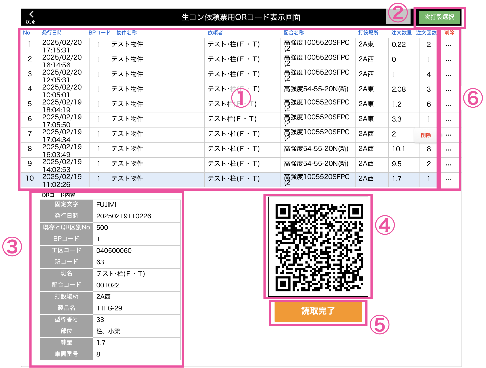
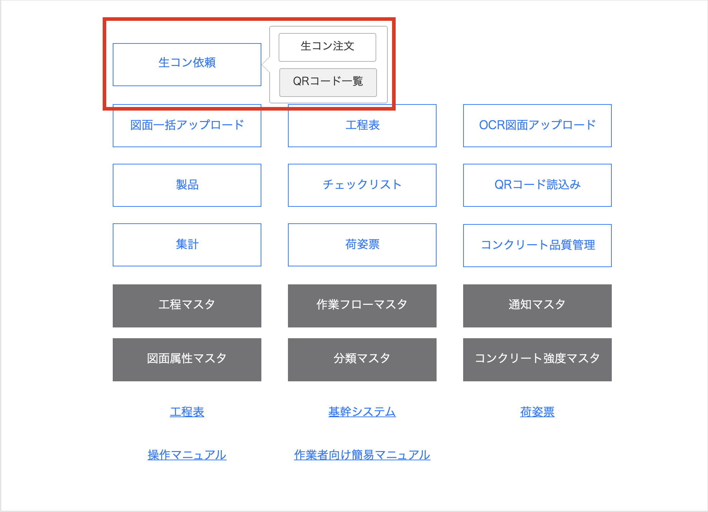
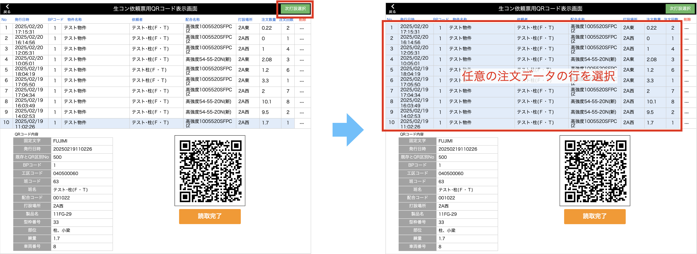
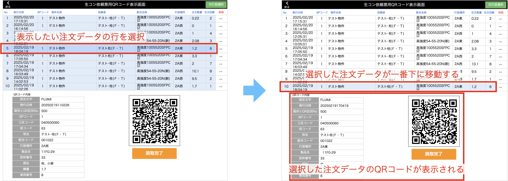
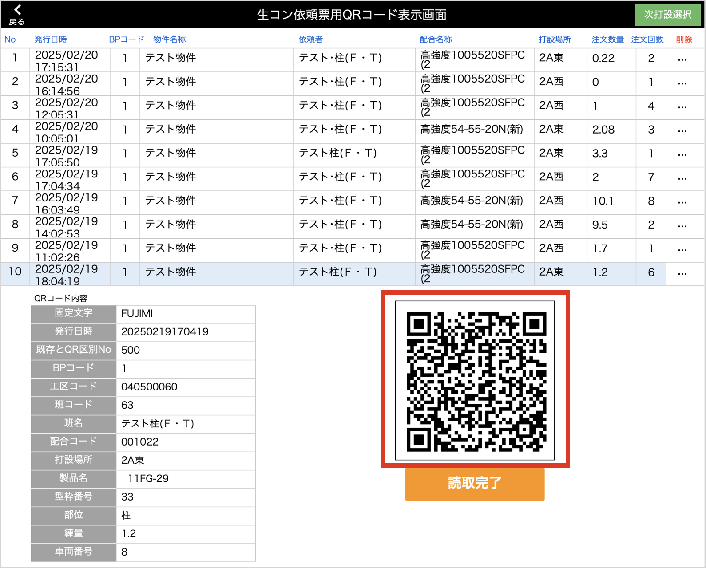
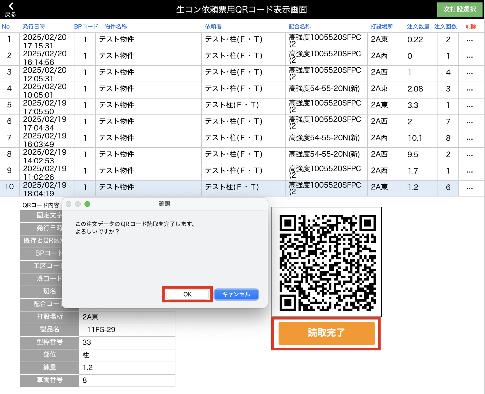

# 生コン注文用のQRコードを表示する

### 画面説明

<table><tr><td>

</td></tr></table>

- ① 注文一覧  
    発行日が古い順で最大10件分の注文情報を一覧で表示します。

- ② 次打設選択ボタン  
    QRコードを表示する注文を切り替えます。

- ③ QRコード内容  
    QRコードに載せる項目の一覧です。注文一覧の一番下に位置している情報が表示されます。

- ④ QRコード  
    注文情報が入ったQRコードです。注文一覧の一番下に位置している情報が表示されます。

- ⑤ 読取完了ボタン  
    QRコード読取後にクリックすることで読取完了となり、注文一覧から除外されます。

- ⑥ 削除ボタン  
    任意の注文情報を一覧から削除します。

 

1. [品質管理システム]トップ画面から「生コン依頼」>「QRコード一覧」をクリックで、QRコード表示画面に移動します。
        
    <table><tr><td>
    
    </td></tr></table>

1. 「次打設選択」ボタンクリックで一覧全体の背景が青くなり、任意の注文データを選択できるようになります。  
        
    <table><tr><td>
    
    </td></tr></table>

1. 任意の注文データの行をクリックすることで、その注文データのQRコードが表示されます。
        
    <table><tr><td>
    
    </td></tr></table>

1. QRコード内容を確認し、QRコードをカメラで読み取ります。
        
    <table><tr><td>
    
    </td></tr></table>

1. QRコード読取が完了したら、「読取完了」ボタンをクリックします。
        
    <table><tr><td>
    
    </td></tr></table>

{: .warning }
「読取完了」した注文データは一覧で表示されなくなります。
