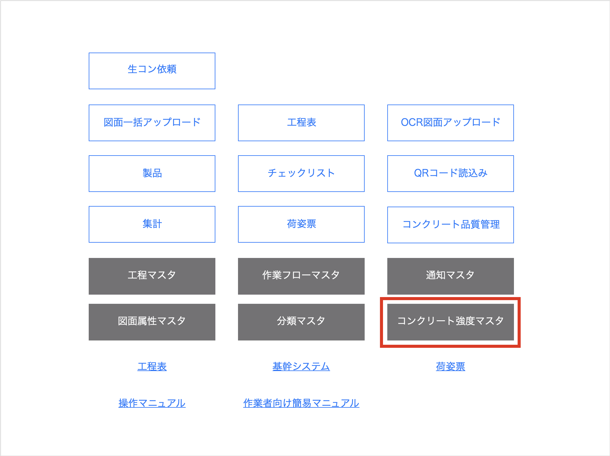
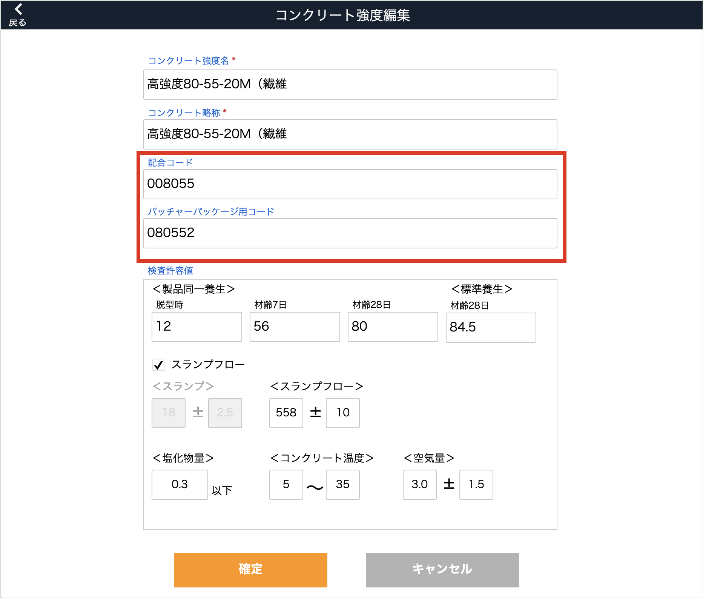
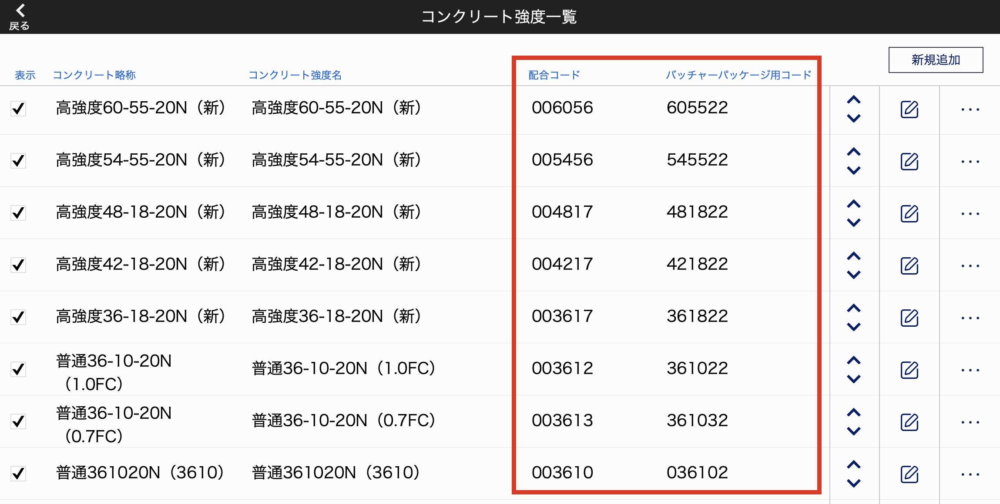

# 配合コード登録

### 品質管理システムのコンクリート強度マスタに、配合コードとバッチャーパッケージ用コードを登録します。

 

1. 品質管理システムTOP画面の「コンクリート強度マスタ」ボタンからコンクリート強度マスタ編集画面に移動します。

    <table><tr><td>
    
    </td></tr></table>

1. コンクリート強度マスタ編集画面の[配合コード]、[バッチャーパッケージ用コード]を入力します。

    <table><tr><td>
    
    </td></tr></table>

1. 登録したそれぞれのコードは一覧画面に表示されます。

    <table><tr><td>
    
    </td></tr></table>

{: .note }
生コン依頼用のQRコードに載る配合コードは、ここで登録したバッチャーパッケージ用コードに変換されます。