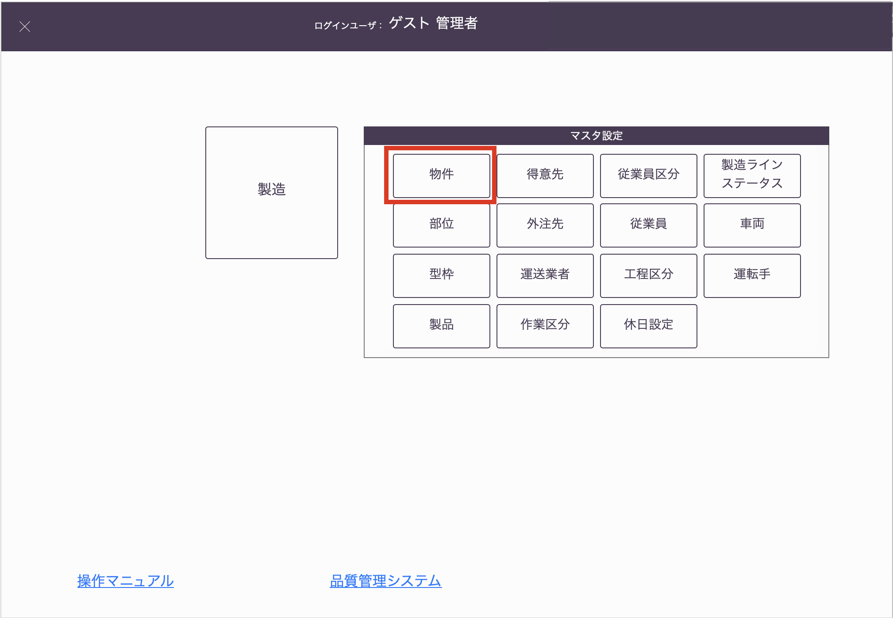
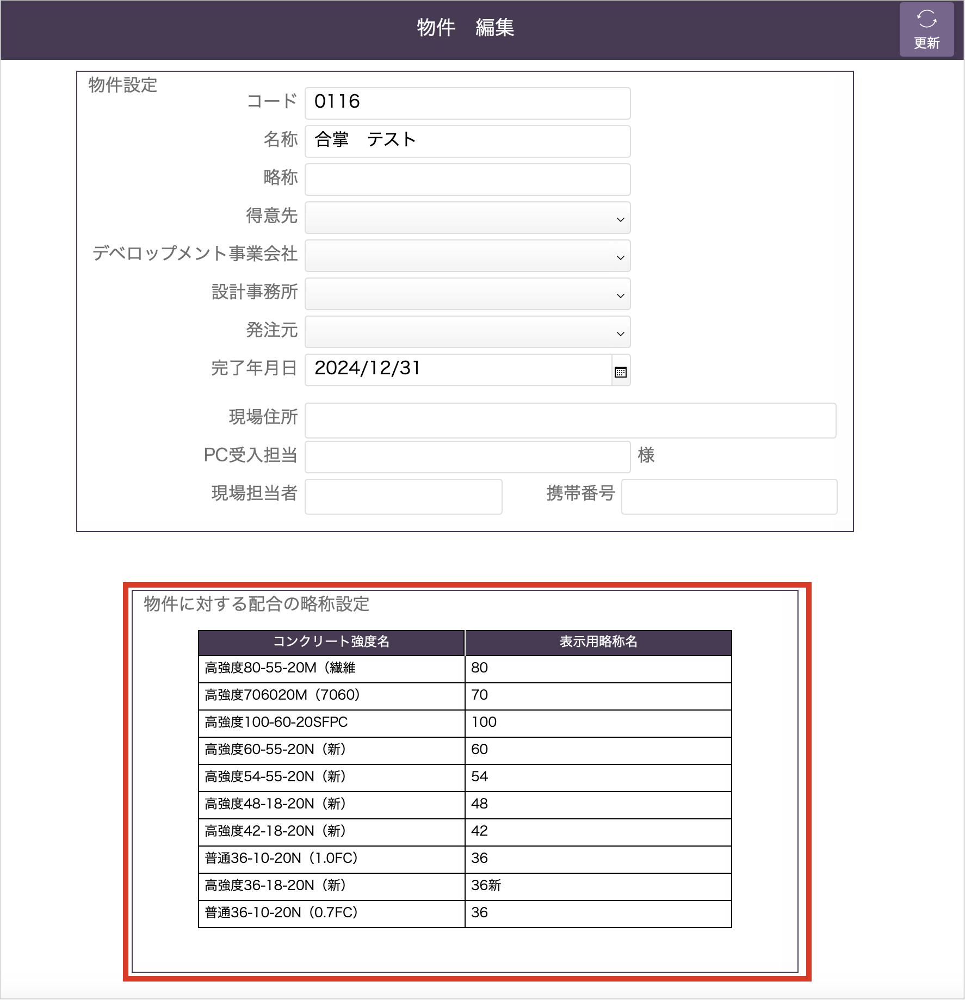
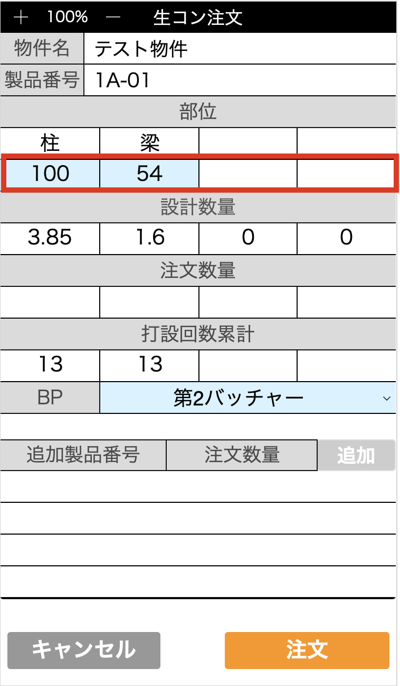

# 略称配合の登録

### 基幹システムの物件マスタに略称配合を登録します。

 

1. 基幹システムTOP画面の「物件」ボタンから物件マスタ編集画面に移動します。

    <table><tr><td>
    
    </td></tr></table>

1. 物件マスタ編集画面の[物件に対する配合の略称設定]項目を入力します。

    <table><tr><td>
    
    </td></tr></table>

1. 登録した略称配合は、生コン注文画面の配合表示に使用されます。

    <table><tr><td>
    
    </td></tr></table>