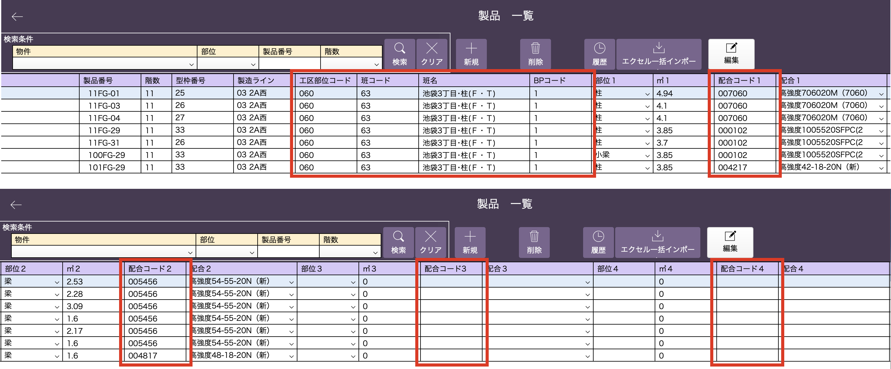

# 製品登録

### 生コン依頼機能に必要となる以下の項目を製品情報に追加登録します。

 
<table><tr><td>

</td></tr></table>

| 追加必須項目      | 文字形式   | 備考                                             | 
| ----------------- | ---------- | ------------------------------------------------ | 
| 工区部位コード    | 半角英数字 |                                                  | 
| 班コード          | 半角英数字 |                                                  | 
| 班名              | テキスト |                                                  | 
| BPコード          | 半角数字 | 0,1,2のいずれか                                  | 
| 配合コード1,2,3,4 | 半角英数字 | コンクリートマスタに登録した配合コードのみ使用可 | 

 
製品登録は[製品マスタの登録]()を参考に行ってください。