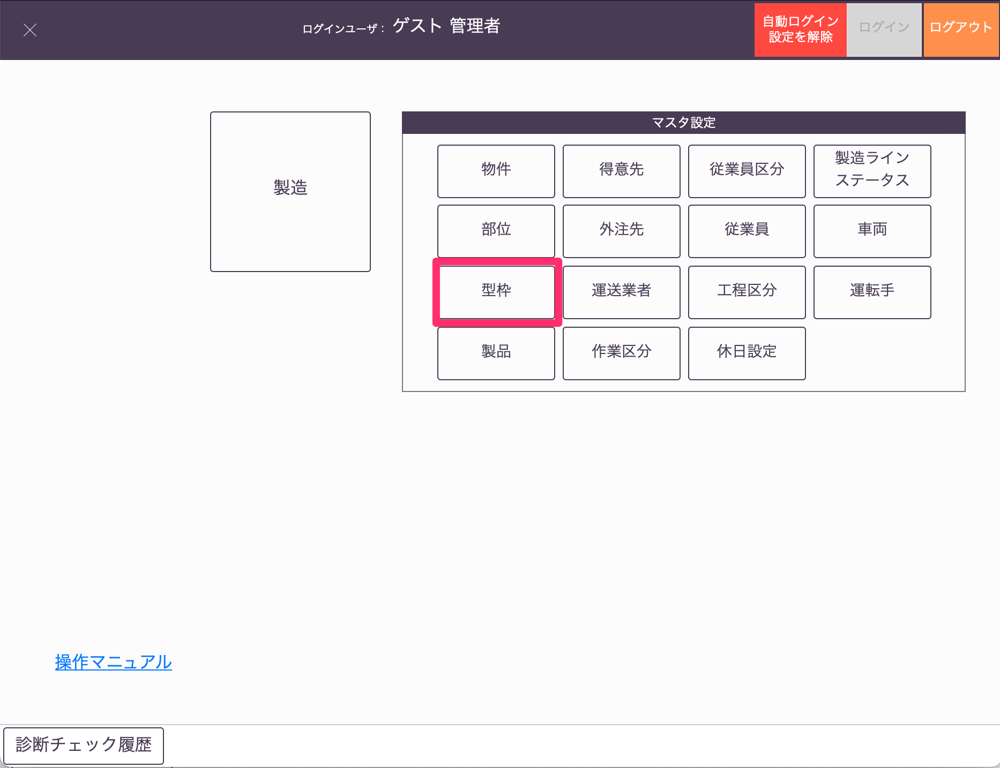
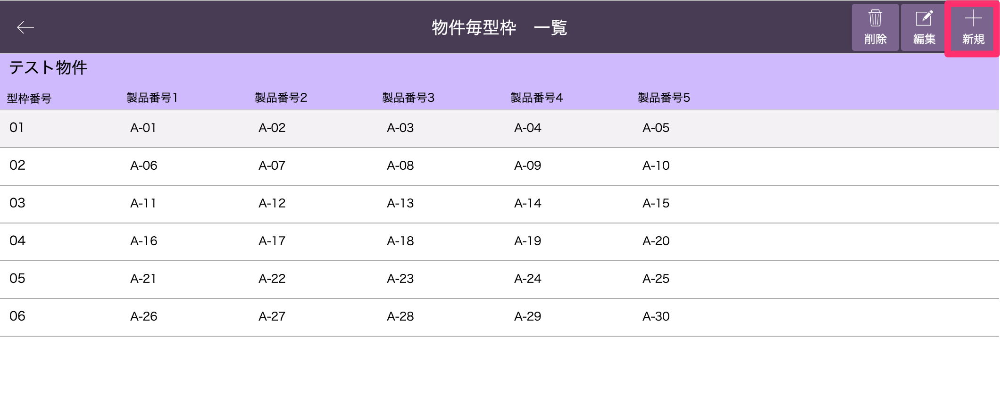
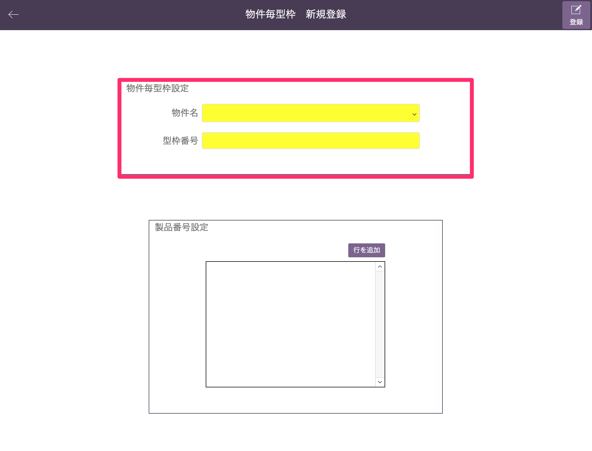
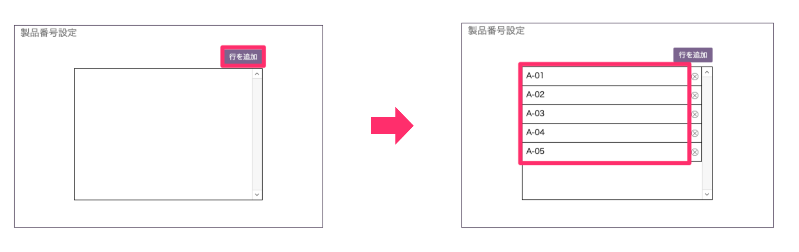
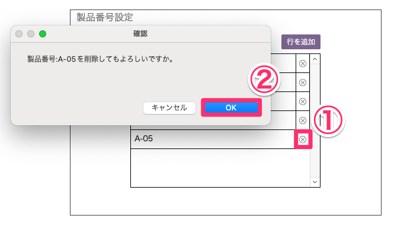
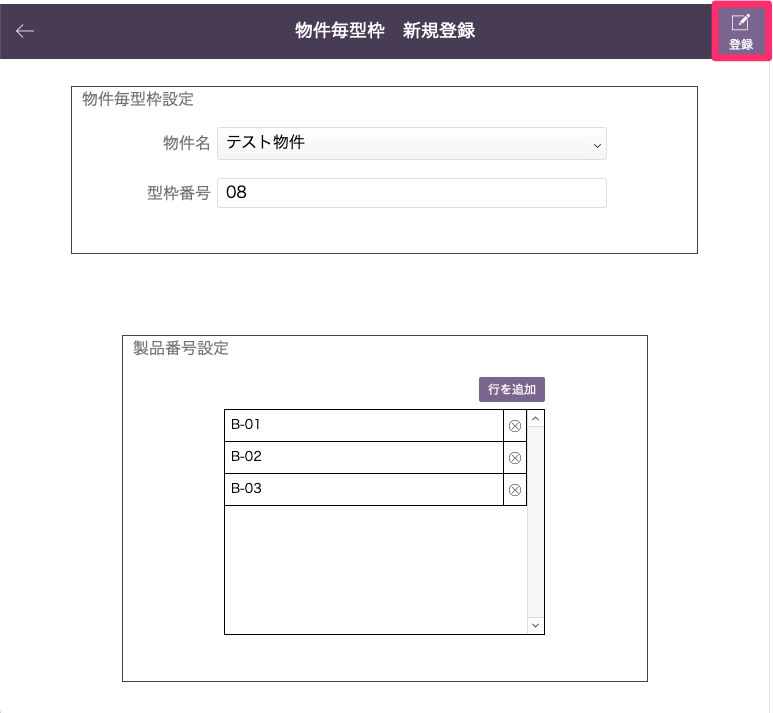
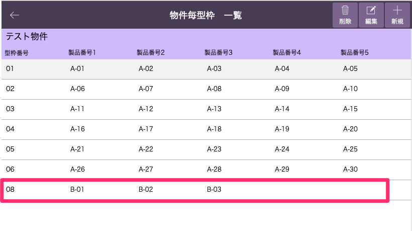

# 物件毎型枠マスタの登録

### 物件毎型枠マスタで物件ごとの型枠番号を事前登録しておくことで、製品インポートの際に型枠番号を自動入力することができます。

1. 「基幹システム」トップ画面の[マスタ設定]から「型枠」マスタを選択します。

    <table><tr><td>
    
    </td></tr></table>

1. [物件毎型枠一覧]画面から「新規」を選択します。

    <table><tr><td>
    
    </td></tr></table>

1. [物件名]、[型枠番号]、[製品番号]を入力します。

    入力欄が黄色になっている[物件名]と[製品番号]は入力必須の項目となります。

    <table><tr><td>
    
    </td></tr></table>

    [製品番号]は「行を追加」をクリックして、任意の製品番号を入力してください。

    <table><tr><td>
    
    </td></tr></table>

    [製品番号]を削除したい場合は、右側の「×ボタン」から行ってください。

    <table><tr><td>
    
    </td></tr></table>

1. 入力が完了したら「登録」を選択します。

    <table><tr><td>
    
    </td></tr></table>

1. 登録した物件毎型枠が[物件毎型枠マスタ一覧]画面に表示されます。

    <table><tr><td>
    
    </td></tr></table>

 
- 登録した型枠番号は[製品インポート]()の際に適用されます。  
    仕様については以下の通りとなります。

|                    | 型枠番号が空欄でインポート | 型枠番号を入力してインポート   | 
| ------------------ | -------------------- | ------------------------------ | 
| 物件毎型枠登録有り   | 物件毎型枠適用       | 物件毎型枠適用                 | 
| 物件毎型枠登録無し | 空欄                 | 入力された型枠番号をインポート | 

{: .warning }
登録した物件毎型枠を適用したい場合は、[物件コード]、[製品番号]を入力したexcelファイルをインポートしてください。