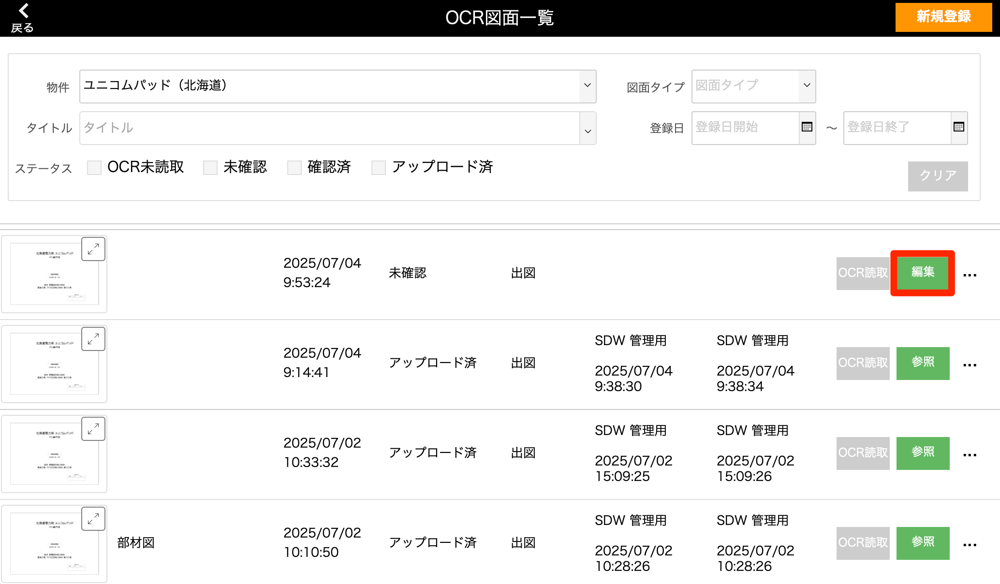
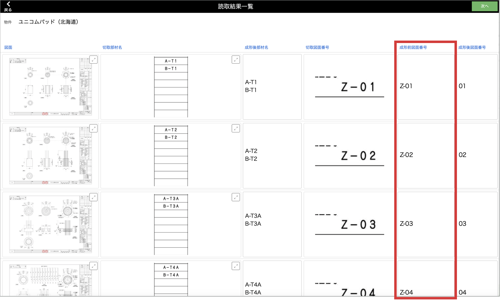
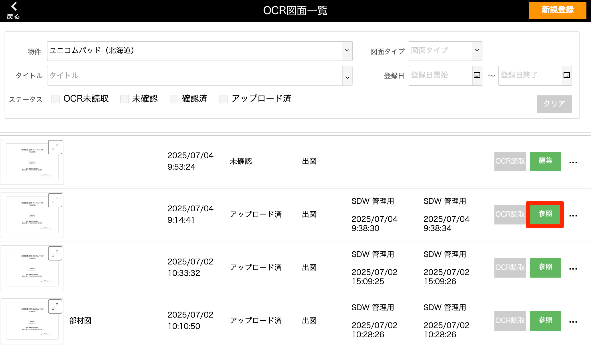
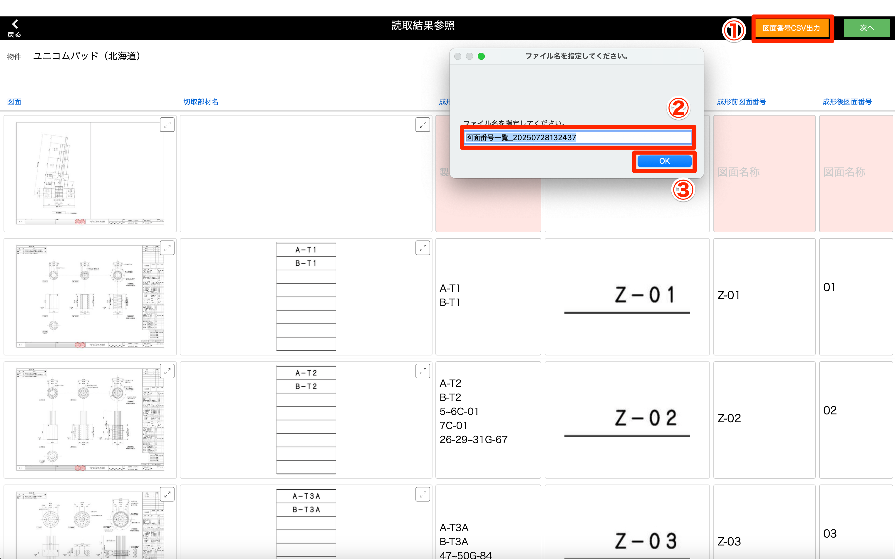
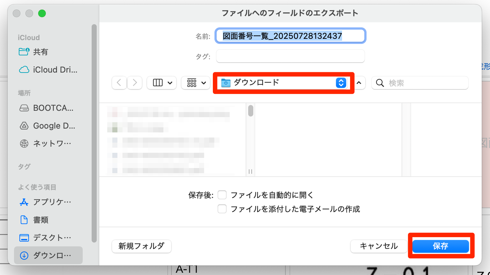
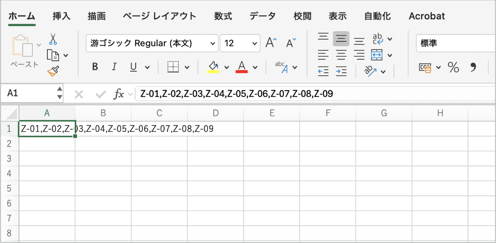

# OCR図面の図面番号をCSV出力する

### 図面番号の確認・手動修正（アップロード前）

1. [OCR図面一覧]画面で図面番号の確認・修正を行いたい図面の「編集」を選択します。

    <table><tr><td>
    
    </td></tr></table>

1. 成形前図面番号が正しく入力されているか確認し、OCR読取間違いがあれば手動で修正します。

    {: .note }
    [成形前図面番号]に入力されている内容がcsv出力されます。

    <table><tr><td>
    
    </td></tr></table>

### 図面番号CSV出力
アップロードを行った図面のみ図面番号のCSV出力が可能となります。

1. [OCR図面一覧]画面で図面番号のCSV出力をしたい図面の「参照」を選択します。

    <table><tr><td>
    
    </td></tr></table>

1. 画面右上の「図面番号csv出力」をクリックし、任意のファイル名を入力します。  

    <table><tr><td>
    
    </td></tr></table>

    {: .note }
    デフォルトのファイル名は[図面番号一覧_出力日時]となります。

1. 出力先を選択して「保存」クリックでCSV出力が完了します。

    <table><tr><td>
    
    </td></tr></table>

    出力形式はカンマ区切りで1つのセルに出力する仕様となります。
    <table><tr><td>
    
    </td></tr></table>