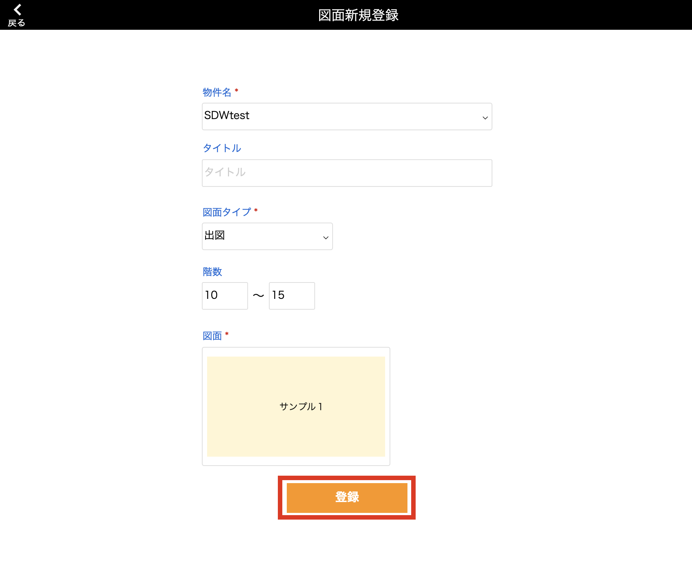
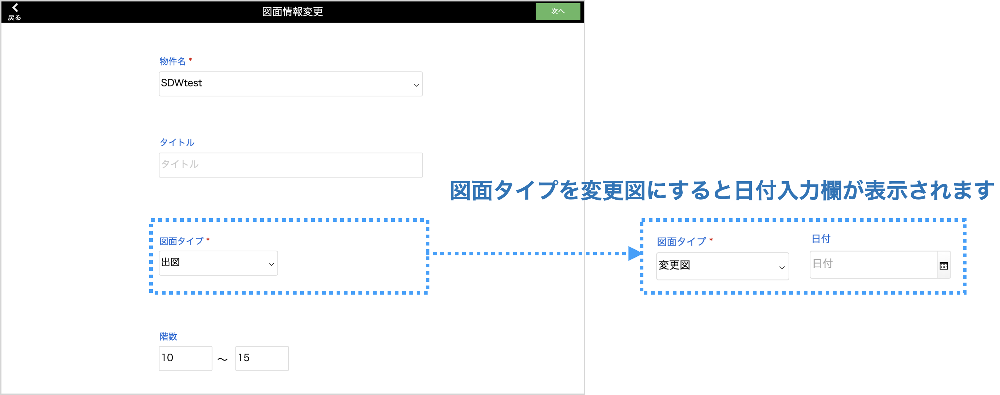

# OCR図面アップロードを行う

### 新規登録

1. [品質管理システム]トップ画面から「OCR図面アップロード」を選択します。
    
    <table><tr><td>
    
    </td></tr></table>

1. [OCR図面一覧]画面右上の「新規登録」を選択します。

    <table><tr><td>
    
    </td></tr></table>

1. 必須項目を入力して「登録」を選択して完了です。

    <table><tr><td>
    
    </td></tr></table>

    {: .warning }
    枚数が多いと登録に時間がかかります。

1. 登録が完了した図面は[OCR図面一覧]画面に表示されます。

    <table><tr><td>
    
    </td></tr></table>

 

### OCR読取

{: .warning }
OCR読取はMacもしくはiPadのみで使用できる機能です。

1. [OCR図面一覧]画面でOCR読取を行いたい図面の「OCR読取」を選択します。

    <table><tr><td>
    
    </td></tr></table>

1. 読み取りたい範囲を四角枠で囲います。読取範囲を指定したら、「次へ」を選択します。

    - 赤枠：部材名（製品番号）  
    - 青枠：図面番号

    <table><tr><td>
    
    </td></tr></table>

    {: .note }
    登録されている図面の一枚目のみ表示されます。また、読取範囲は他の図面も共通となります。

1. OCR読取結果が表示されます。内容を確認したら「OCR保存」選択でOCR読取を完了します。

    <table><tr><td>
    
    </td></tr></table>

    {: .note }
    読み取った部材名と図面番号はこの画面上でも後からでも修正が可能です。

    {: .warning }
    「OCR保存」を行うとOCR読取をやり直すことができなくなります。

 

### 図面内容編集

1. [OCR図面一覧]画面で編集を行いたい図面の「編集」を選択します。

    <table><tr><td>
    
    </td></tr></table>

1. OCR読取を行なった部材名と図面番号の手動修正を行います。確認したら「次へ」を選択します。

    - 入力例

    | 入力部材名                       | 対象製品番号                                           | 
    | -------------------------------- | ------------------------------------------------------ | 
    | 37C-19                           | 37C-19                                                 | 
    | 37·38C-19                        | 37C-19、38C-19                                         | 
    | 37C~41C-19                       | 37C-19、38C-19、39C-19、40C-19、41C-19                 | 
    | 30C-20 40·41C-20 50~53C-20 | 30C-20、40C-20、41C-20、50C-20、51C-20、52C-20、53C-20 | 

    {: .warning }
    記号や英数字は半角で入力してください。

    <table><tr><td>
    
    </td></tr></table>

1. 物件名や図面タイプなど、間違いがあれば手動修正を行います。確認したら「次へ」を選択します。

    <table><tr><td>
    
    </td></tr></table>

1. 入力した図面番号と部材名が一覧で表示されます。  
    変更図として登録し日付を入力した場合は、日付付き図面番号が表示されます。

    - 「詳細」  
    クリックで各図面を登録する対象の製品番号が表示されます。
    - 「確認欄」  
    チェックをつけると、確認者名と確認日時が登録されます。

    <table><tr><td>
    
    </td></tr></table>

1. 図面をアップする対象の製品番号が一覧で表示されます。アップする図面IDや対象製品を変更することが可能です。

    <table><tr><td>
    
    </td></tr></table>

    図面番号は、基幹システム＞製品マスタにも自動で入力されます。
    <table><tr><td>
    
    </td></tr></table>

 

### 図面アップロード

1. [出図・変更図一覧]画面の右上にある「アップロード」を選択して完了です。

    <table><tr><td>
    
    </td></tr></table>

    {: .warning }
    確認欄①,②にチェックをつけることで図面のアップロードが可能となります。

1. アップロードが完了した図面は編集不可となり、参照のみ可能となります。

    <table><tr><td>
    
    </td></tr></table>

 

### ○補足

1. 図面の削除は[OCR図面一覧]画面から行うことができます。

    <table><tr><td>
    
    </td></tr></table>

    {: .warning }
    アップロード済みの図面は削除不可となります。
